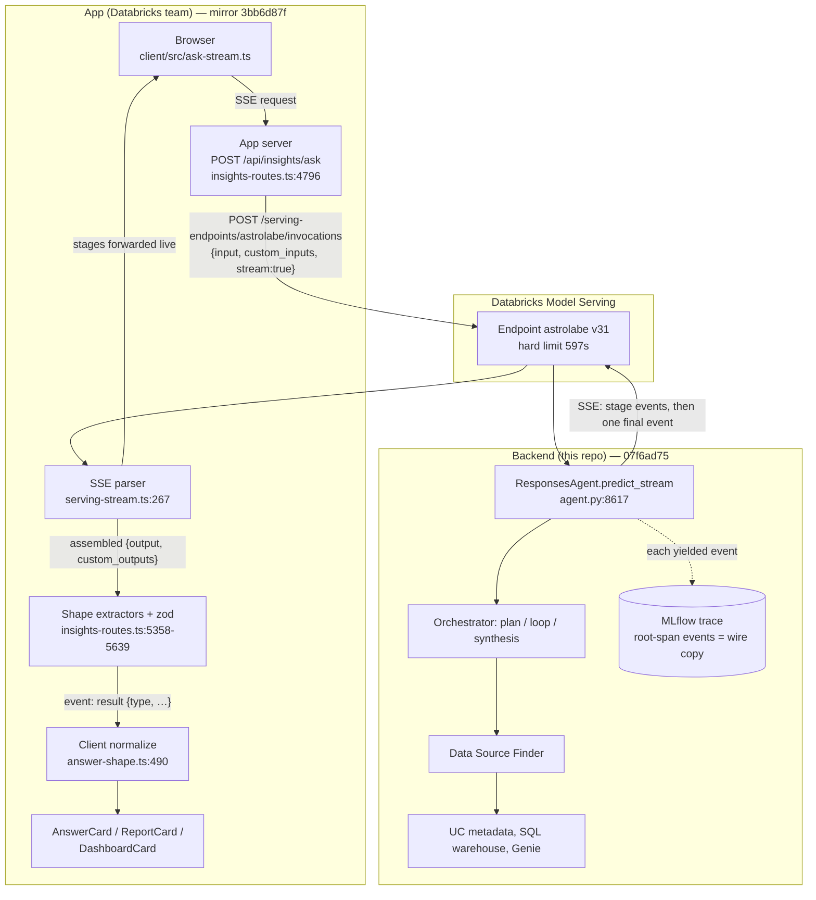
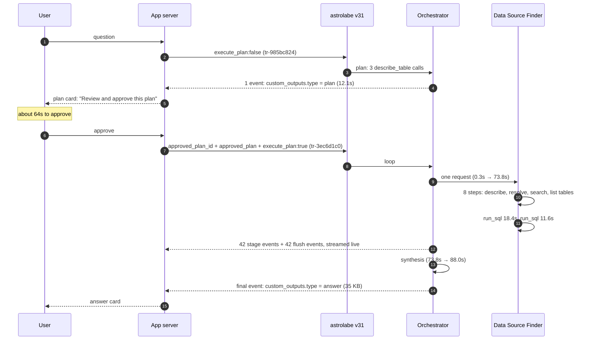
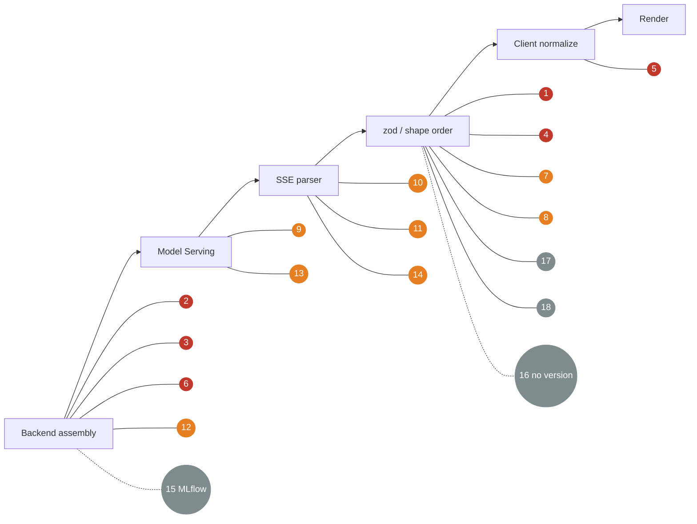

# Backend → app handoff contract

MIT-14733. Pinned to backend `07f6ad75` (endpoint `astrolabe` v31, 100% of traffic) and the app mirror `3bb6d87f`. Written 2026-09-22.

Files in this folder:

1. [template.json](template.json): every key, its type, and how the app validates it.
2. [example-request-plan.json](example-request-plan.json) and [example-request-execute.json](example-request-execute.json): the real request bodies.
3. [example-plan-response.json](example-plan-response.json) and [example-answer-response.json](example-answer-response.json): the real streamed responses.
4. [failure-points.md](failure-points.md): 18 places the handoff breaks, numbered to match the diagram below.

The examples come from one conversation, `conv-8b7b0c70`. Its two MLflow traces are in experiment `1321085950225033`:

- `tr-985bc824ddfccc91acd2beeb011b753b`: the plan turn
- `tr-3ec6d1c0bd80fc70c384701d26eca547`: the execute turn

## What the backend hands off

1. **Transport.** The app sends one HTTP POST per turn and gets back a **stream of JSON events (SSE)**. It is not one JSON document.
2. **Envelope.** Every event is JSON. The last one carries the payload in `custom_outputs = {type, <payload>}`.
3. **Markdown inside JSON.** `takeaway`, `narrative`, `content`, plan `summary` and report `body` are Markdown strings. There is also a plain-text copy: `item.content[0].text` holds takeaway + narrative + content joined.
4. **Seven payload types**: `answer`, `plan`, `clarification`, `report`, `dashboard`, `unavailable`, `preflight_retired`. Every one comes back as HTTP 200.
   - The app read five shapes until today: plan, clarification, report, answer, and live text.
   - `dashboard` is the sixth. It was added to the backend in `6185d23f` and to the app in `3bb6d87f`, both on 2026-09-22.
5. **Key counts**:

   | Object | Keys | Backend model | App validator |
   |---|---|---|---|
   | answer | 13 | `AnswerContract` | `LiveAnswerSchema`, loose |
   | answer.trace | 9 | `TraceSummary` | `TraceSchema`, loose |
   | trace.stages[] | 11 | `TraceStage` | `StageSchema`, loose |
   | plan | 8 | `AnalysisPlan` | `AnalysisPlanSchema`, loose |
   | clarification | 5 | `Clarification` | `ClarificationSchema`, loose |
   | report | 10 | `Report` | hand-written normalizer |
   | dashboard | 6 | `Dashboard` | hand-written normalizer |

   The backend models are in `agent/contracts.py`. "Loose" means the app keeps keys it does not know about and logs them.

6. **No version on the core three.**
   - `answer`, `plan` and `clarification` have no `schema_version`.
   - `report` (`pia.report/1`) and `dashboard` (`pia.dashboard/1`) do.
7. **Size, from the real execute turn:** 85 events and 81 KB in total, 35 KB of it in the final answer event. The turn took 88.0s.

## What the real answer looked like on the wire

This is `tr-3ec6d1c0`, the final event, shortened. The full version is in [example-answer-response.json](example-answer-response.json).

**The examples are sanitized.** Every key, list length, type, id, timing and token count is real. Every string that carried query content (question, table and column names, figures, SQL, caveats, stage input/output) has been replaced with fictional values. The plan id `plan-b89925d339d0f590` is kept from the real trace, so it will not match what the backend would recompute from the fictional plan.

```json
{
  "type": "response.output_item.done",
  "item": { "type": "message", "id": "response-993b…", "role": "assistant",
            "content": [{ "type": "output_text", "text": "**120 players** sit in all three groups…" }] },
  "custom_outputs": {
    "type": "answer",
    "answer": {
      "id": "msg-…", "takeaway": "**120 players** sit in…", "narrative": "", "content": "",
      "figures": [4 items], "charts": [], "chart_evidence": [2], "sources": [4],
      "document_snippets": [], "caveats": [5], "derivation": [2], "sql": "WITH members AS (…",
      "trace": { "id": "tr-…", "totalMs": 87981, "toolCalls": 19, "stages": [21],
                 "genie_spaces": [], "resource_calls": [],
                 "prompt_tokens": …, "completion_tokens": …, "total_tokens": 106381 }
    }
  }
}
```

`narrative` and `content` are empty because the app sent `answer.narrative: false`. That setting also blanks `content`, so the 7-row table that synthesis wrote never left the backend. See failure point #3.

## Wiring



## One conversation, two turns (real timings)



## Where it breaks

The numbers match [failure-points.md](failure-points.md). A red node means silent: the user gets something that looks like an answer.



Colors:

- **Red**: silent.
- **Orange**: loud (an error), or slow (#14).
- **Grey**: evidence is hard to find.

## The three findings that matter most

1. **The app's own validator failing is silent** (#1).
   - Any answer that fails `LiveAnswerSchema` becomes a prose card, with no log line.
   - The first thing to ask the app team for is a log line at `insights-routes.ts:2477`.
2. **One Settings toggle breaks every answer** (#2).
   - Turning off `takeaway` makes the backend send `""`.
   - The app requires at least 1 character, so every structured answer fails #1.
3. **The MLflow trace does hold the full payload, but not where you would look** (#15).
   - The root span's Outputs field has no `custom_outputs`.
   - The exact wire copy is in the root span's events, `mlflow.chunk.item.0…N`. To read it:

```bash
databricks api get "/api/2.0/mlflow/get-trace-artifact?request_id=<trace id>"
```

Then read `spans[name=predict_stream].events[*].attributes["mlflow.chunk.value"]`.

The last event is exactly what the app's SSE parser received.
